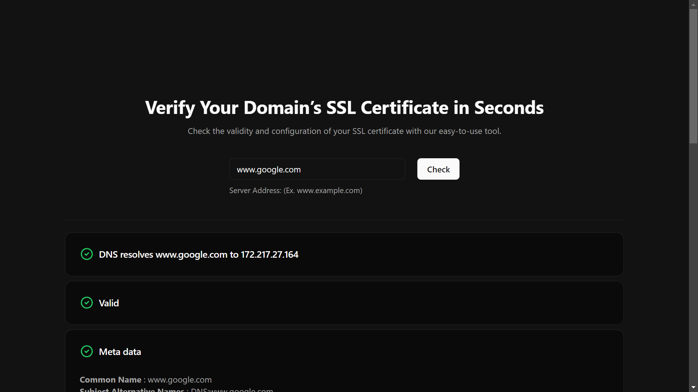

# SSL Checker Tool - Frontend



This project is a frontend application that allows users to check the SSL certificate of a given domain. The tool provides detailed information about the SSL certificate, including its validity, expiration date, issuer details, and more.

## Features

The SSL Checker Tool displays the following certificate details:

- **Validity Status**: Indicates whether the SSL certificate is currently valid or not.
- **Expiration Date**: The date when the SSL certificate will expire.
- **Issuer Details**: Information about the Certificate Authority (CA) that issued the SSL certificate.
- **Subject Details**: Information about the owner or entity for which the SSL certificate was issued.
- **Domain Validity**: Verifies whether the SSL certificate is valid for the input domain.
- **CA Validity**: Checks if the Certificate Authority (CA) is a valid, trusted authority.
- **Self-signed Certificate Check**: Determines whether the certificate is self-signed.
- **CRL/OCSP Status**: Displays the status of the certificate from Certificate Revocation List (CRL) or Online Certificate Status Protocol (OCSP) checks.
- **Certificate Chain**: Displays the chain of certificates from the domain's SSL certificate to the root certificate authority.

## Getting Started

### Prerequisites

To run the project, ensure you have the following installed:

- Node.js (v14 or higher)
- npm or yarn

### Installation

1. Clone the repository:

   ```bash
   git clone https://github.com/deepanwar/ssl-checker-frontend.git
   ```

2. Navigate to the project directory:

   ```bash
   cd ssl-checker-frontend
   ```

3. Install the dependencies:

   ```bash
   npm install
   ```

   or

   ```bash
   yarn install
   ```

### Running the Application

Start the development server:

```bash
npm start
```

or

```bash
yarn start
```

Open your browser and navigate to `http://localhost:5173` to use the SSL Checker Tool.

### Building for Production

To build the project for production, run:

```bash
npm run build
```

or

```bash
yarn build
```

This will create an optimized production build in the `dist/` directory.

## Technologies Used

- **React.js**: Core library for building the user interface.
- **TanStack Query**: For efficient data fetching, caching, and synchronization.
- **React Router DOM**: Handles client-side routing within the application.
- **Shadcn UI**: A component-based UI library for building user interfaces.
- **Axios**: Used for making HTTP requests to interact with APIs.
- **Zod**: Schema-based validation library to ensure data integrity.
- **React Hook Form**: Simplifies form management and validation.

## Usage

Enter the domain name in the input field and click the "Check SSL" button. The application will display the following information about the SSL certificate:

- **Validity Status**
- **Expiration Date**
- **Issuer and Subject Details**
- **Domain Validity**
- **CA and Self-signed Status**
- **CRL/OCSP Status**
- **Certificate Chain**
